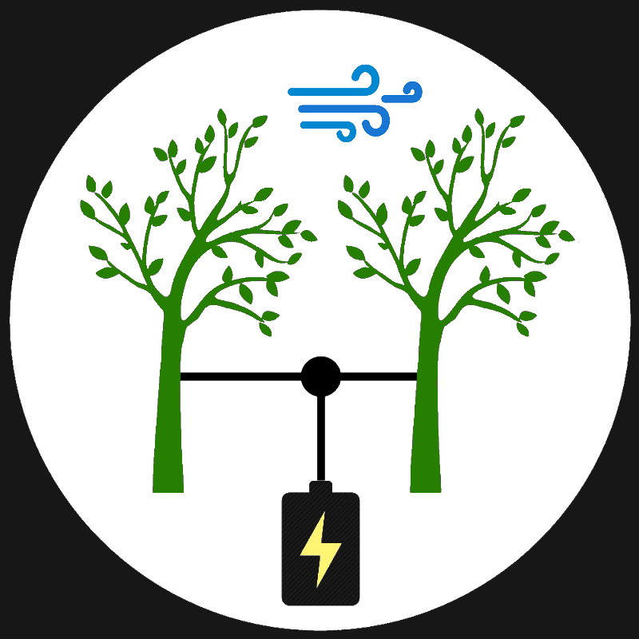

# Harvester
Harvester is a Open Source project to convert oscillations into usable energy.

more information can be found on the project page:

https://hackaday.io/project/159350-harvester-building-the-energy-forest

